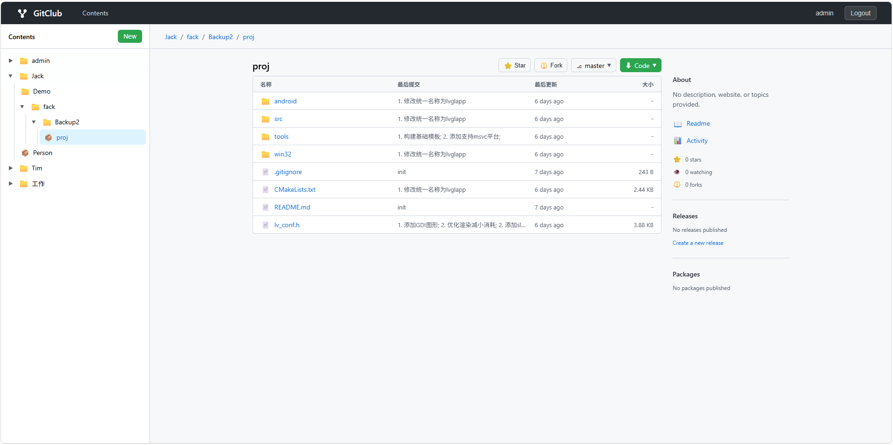
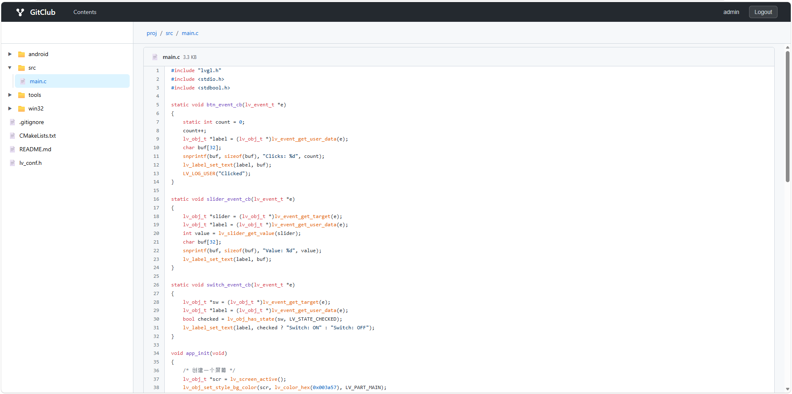

# GitClub 🚀

A lightweight, self-hosted Git server built with Rust and Vue.js. Simple, fast, and elegant.

## ✨ Features



Code Tree Visualization



- 🔐 **User Authentication** - Secure login and registration with JWT
- 📁 **Hierarchical Organization** - Groups and repositories with nested structure
- 👥 **Team Collaboration** - Fine-grained member permissions and access control
- 🌳 **Git HTTP Protocol** - Full git push/pull support with smart HTTP
- 📦 **Push-to-Create** - Automatically create repositories on first push
- 🎨 **Modern UI** - Clean, GitHub-inspired interface
- 🔍 **File Browser** - Browse repository files and view code online
- 📝 **Markdown Support** - Render README files beautifully

## 🚀 Quick Start

```bash
# Clone the repository
git clone https://github.com/yourusername/gitclub.git
cd gitclub

# Build and run
cargo run --release
```

The server will start at `http://localhost:3000`

Default admin credentials:
- Username: `admin`
- Password: `admin123456`

## 🛠️ Configuration

Edit `app.ini` to customize:

```ini
[server]
addr=localhost
port=3000

[paths]
data=/your/path/to/data
log=/your/path/to/log
repos=/your/path/to/repos

[admin]
username=admin
password=admin123456
```

## 📖 Usage

### Create a Repository

```bash
# Via Web UI
Click "New" → Select "Repository" → Enter name

# Via Git Push
git remote add origin http://localhost:3000/username/myrepo.git
git push -u origin main
```

### Clone a Repository

```bash
git clone http://username@localhost:3000/username/myrepo.git
```

## 🏗️ Tech Stack

- **Backend**: Rust + Axum + SQLite
- **Frontend**: Vue.js 3 + Vite
- **Git**: Native git commands via HTTP protocol

## 📝 License

MIT License - feel free to use this project however you like!

## 🤝 Contributing

Contributions are welcome! Feel free to open issues or submit pull requests.

---

Built with ❤️ using Rust and Vue.js
